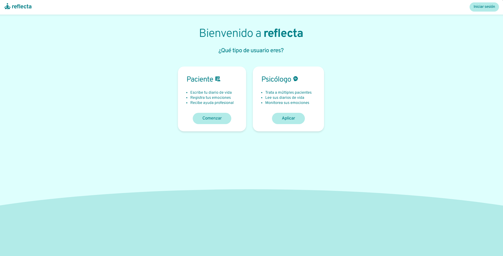
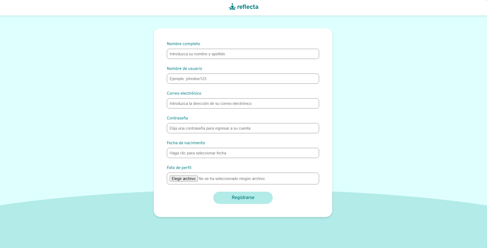
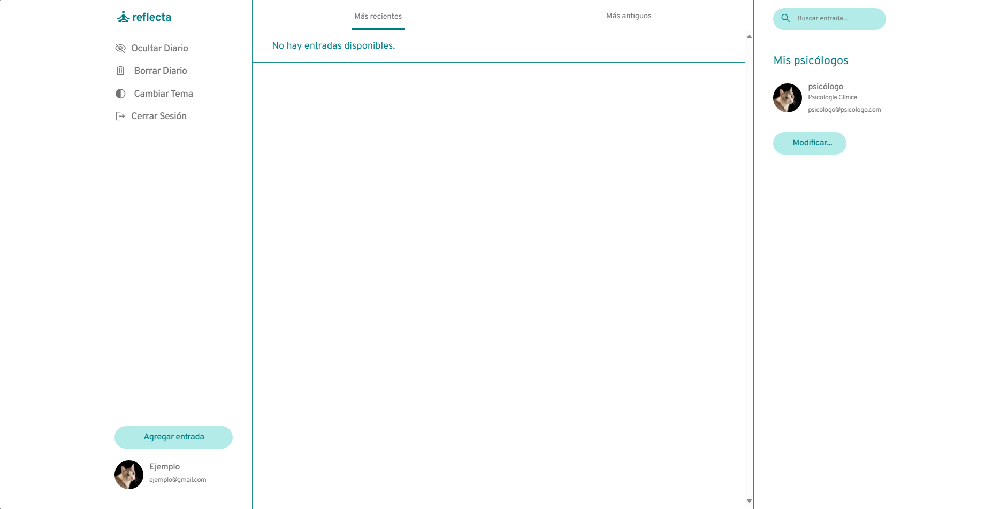
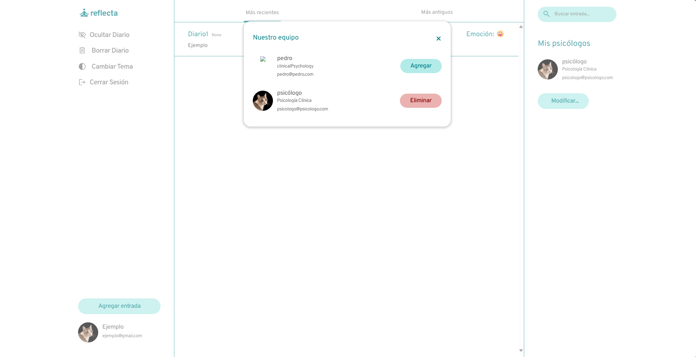
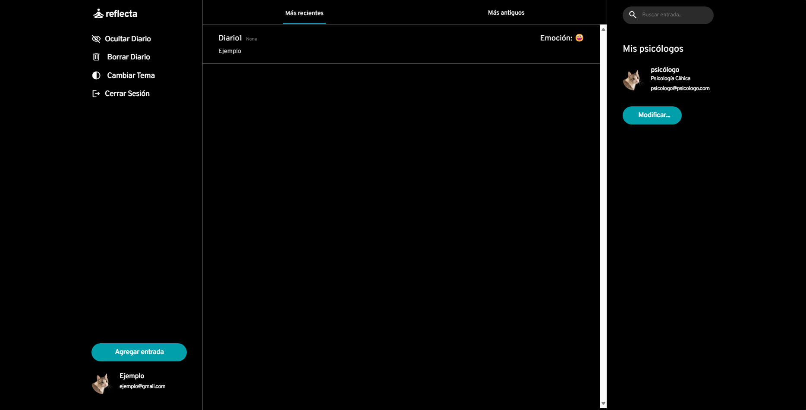
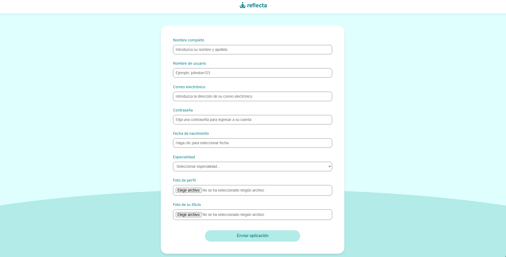
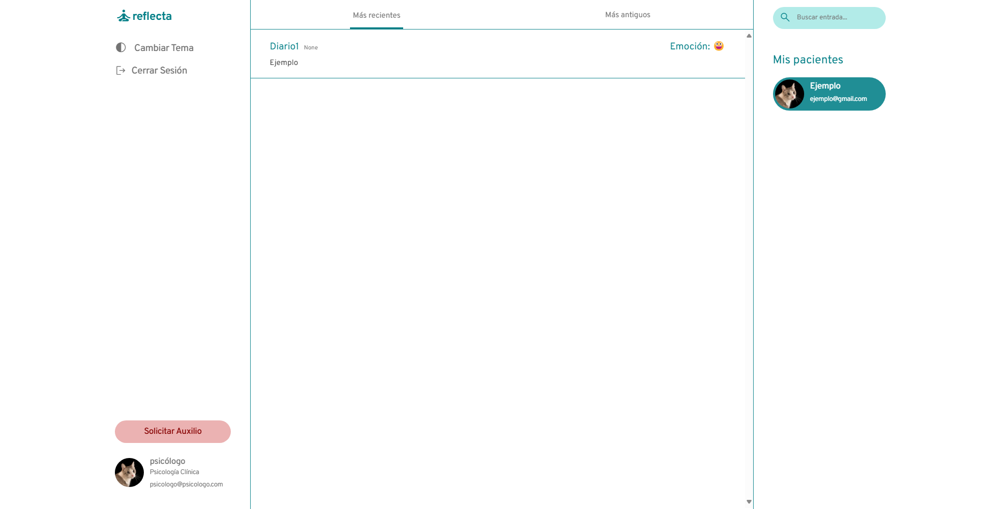
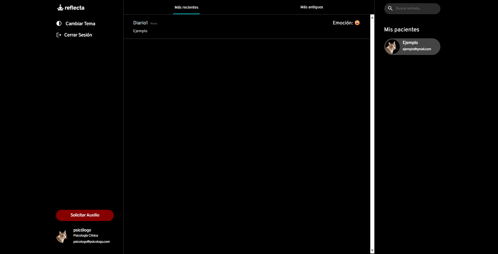

# reflecta ✨

**reflecta** es una aplicación web diseñada para otorgarle a los usuarios apoyo psicológico mediante el registro de un diario de vida. Este diario de vida puede ser accesible por uno o más terapeutas entrenados profesionalmente, escogidos por el usuario, con el fin de que estos pueden leer y generar una red de apoyo y confianza para el paciente.

### Instrucciones para correr la aplicación 🚀

- Asegúrese de tener instalado los requerimientos del proyecto: ``pip install -r requirements.txt``
- Antes de ejecutar la aplicación, asegúrese de crear la base de datos y los modelos, mediante los comandos ``python manage.py makemigrations`` y luego ``python manage.py migrate``
- Para ejecutar la aplicación Django, ejecute el comando ``python manage.py runserver``
- Finalmente diríjase a la URL provista en la consola para comenzar a explorar la aplicacion localmente

### Instrucciones para utilizar la aplicación
Al ingresar a la aplicación, se muestra la página principal, donde hay tres opciones: registrarse como Paciente, registrarse como Psicólogo, o iniciar sesión si ya se tiene una cuenta registrada.
 
*Página principal* 

- #### Si se quiere registrar como Paciente:
    1. Seleccionar **Comenzar** en la página principal para dirigirse al formulario de registro:         
    

    2. Luego de completar el formulario, se presenta la siguiente página
    

    - Existen diversas opciones desde aquí, la principal **Agregar entrada**, la cual permite subir el diario del paciente. Ejemplo de su uso:
     
*Dónde el Título de la entrada es "Diario2" y ¿Cómo te sientes? vendría a ser "Este es el segundo día publicando mi diario"*

     
    
    - Lás demás opciones consisten en: **Mis psicólogos**, donde se puede administrar los psicólogos que podrán ver sus diarios. Donde al seleccionar "Modificar" se muestra el siguiente apartado:
    

    - **Ocultar Diario** oculta los diarios del paciente a su psicólogo, **Borrar Diario** borra los diarios del paciente y **Cerrar Sesión**, que cierra la sesión del usuario. 
    - Además de **Cambiar tema** que modifica el aspecto de la página a un modo oscuro. Ejemplo de uso del modo oscuro:
    

- #### Si se quiere registrar como Psicólogo:
    1. Seleccionar **Aplicar** en la página principal, respondiendo el formulario en la página siguiente.
    

    2. Ya en la interfaz del psicólogo, se muestran los diarios de los pacientes
    

     

    - Las opciones disponibles son **Cambiar Tema** y **Cerrar Sesión** al igual que la interfaz del paciente. Además de la opción de seleccionar entre sus pacientes, que le permite la posibilidad de ver los diarios de estos. Ejemplo del modo oscuro:
    

- #### Si ya se está registrado
    - Seleccionar **Iniciar sesión**, completar el formulario para dirigirse a la interfaz del usuario que le corresponda.
